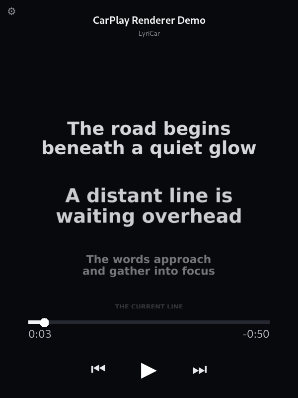

# LyriCar

LyriCar è un’app iOS privata focalizzata su un solo compito: mostrare in modo leggibile i testi sincronizzati del brano che Spotify sta già riproducendo.

Spotify continua a gestire ricerca, playlist, libreria, coda e riproduzione. LyriCar riceve titolo, artista, durata, posizione e stato; recupera i lyrics sincronizzati, filtra i timestamp obsoleti e disegna:

- riga attiva grande;
- righe `-1/+1` più piccole e attenuate;
- righe `-2/+2` ancora più piccole e sfumate;
- transizione prospettica bidirezionale;
- barra di avanzamento;
- tempo trascorso e restante;
- precedente, play/pausa e successivo.



## Versione corrente

**0.2.0-alpha.7 — iPhone First Run**

Questa revisione mantiene invariato il renderer Windows sub-pixel approvato e prepara la prima installazione iPhone realmente utilizzabile:

- modalità demo interna, senza account Spotify;
- Client ID inseribile direttamente nell’app;
- OAuth PKCE con Redirect URI dedicata, mostrata direttamente nell’app;
- nessuna ricompilazione necessaria per cambiare Client ID;
- build standard separata dal proof of concept CarPlay fullscreen;
- due IPA prodotte automaticamente da GitHub Actions;
- runner Xcode 27;
- Live Activity mantenuta nella build standard.

## Stato M0–M5

| Milestone | Stato | Contenuto |
|---|---|---|
| M0 — Renderer | Approvata | Preview Windows 9,3", transizione sub-pixel, barra e controlli |
| M1 — Lyrics | Implementata e testata | LRC, LRCLIB, ranking, cache, offset, seek e sincronizzazione |
| M2 — Spotify | Implementata | PKCE, token refresh, Now Playing, clock locale e controlli |
| M3 — iPhone | Pronta per CI e dispositivo | SwiftUI, demo interna, Client ID runtime, Keychain, impostazioni |
| M4 — CarPlay | Doppio percorso | Live Activity standard + target `CPWindow` sperimentale isolato |
| M5 — Stabilità | Implementata | test, CI, packaging, privacy manifest e documentazione |

## Requisiti

- iPhone/iPad con iOS 26 o successivo;
- Spotify Premium per il percorso Web API e i controlli Player;
- un Client ID Spotify Developer personale per collegare Spotify su iPhone;
- GitHub Actions per compilare l’IPA da Windows;
- metodo personale di firma/sideload per installare l’IPA non firmata.

La Preview Windows locale non richiede Client ID: legge direttamente la sessione multimediale di Spotify tramite Windows Media Control.

## Build iOS separate

### `LyriCar`

Build standard e consigliata:

- app iPhone;
- modalità demo;
- Spotify;
- lyrics;
- Live Activity;
- nessun entitlement CarPlay navigation non concesso;
- codice `CPWindow` escluso dal target standard.

### `LyriCarExperimental`

Build proof of concept:

- tutte le funzioni standard;
- scena `CPTemplateApplicationScene`;
- `CPMapTemplate` radice;
- renderer SwiftUI nella `CPWindow`;
- entitlement `com.apple.developer.carplay-maps`.

La seconda build può essere compilata senza firma, ma il fullscreen non diventa disponibile finché la firma/provisioning non contiene davvero l’entitlement concesso da Apple.

## Avvio Preview Windows

Demo:

```text
WindowsPreview\run_preview.bat
```

Spotify locale senza Client ID:

```text
WindowsPreview\run_spotify_locale.bat
```

Comandi principali:

- `F11`: fullscreen;
- `Esc`: esci dal fullscreen;
- `Spazio`: play/pausa;
- frecce: precedente/successivo;
- `Ctrl+L`: carica `.lrc`.

## Prima prova iPhone da Windows

Consulta:

- [START_HERE_IPHONE_WINDOWS.md](START_HERE_IPHONE_WINDOWS.md)
- [docs/GITHUB_SETUP.md](docs/GITHUB_SETUP.md)
- [docs/SPOTIFY_SETUP.md](docs/SPOTIFY_SETUP.md)

In sintesi:

```text
GitHub Actions → Build distributables
→ scarica LyriCar-standard-unsigned-IPA
→ firma/sideload
→ apri la demo
→ configura Spotify dentro l’app
```

## Test locali

```bash
swift test
python3 -m unittest discover -s WindowsPreview/tests -v
./scripts/validate.sh
```

Stato di questa consegna:

- **17/17 test Swift superati**;
- **20/20 test Python superati**;
- tutti i sorgenti Swift accettati dal parser;
- plist e YAML validi;
- build standard e sperimentale separate nel progetto;
- type-check e linking iOS da eseguire tramite il workflow Xcode 27.

## Privacy

- token Spotify nel Keychain iOS;
- Client ID in `UserDefaults` perché non è un segreto;
- cache lyrics locale;
- nessuna telemetria;
- Drive Mode opzionale: le coordinate Core Location vengono ignorate, non archiviate e non trasmesse.

## Struttura

```text
LyriCar/
├── Sources/LyriCarCore
├── Tests/LyriCarCoreTests
├── LyriCarApp
├── LyriCarWidgets
├── WindowsPreview
├── Config
├── scripts
├── docs
└── .github/workflows
```

## Licenza

Codice LyriCar: MIT. Spotify Web API, LRCLIB, CarPlay e ActivityKit restano soggetti ai termini dei rispettivi servizi e SDK.
